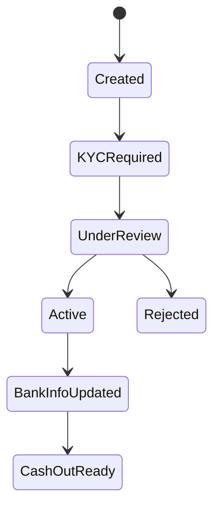

# Marketplace onboarding

Marketplace docs should make vendor onboarding operationally clear: who collects data, who verifies it, and what status each vendor is in.



## Create the vendor

Register the vendor account with the marketplace API and store the HiPay vendor identifier in the marketplace back office.



## Collect KYC documents

Upload required identification and legal documents. Keep the vendor-facing checklist specific to country and business type.



## Add bank information

Collect and validate bank details before enabling cash-out.



## Monitor status changes

Use notifications and status checks to show vendors what is missing and when payouts can start.




[Marketplace vendor API](https://raw.githubusercontent.com/hipay/openapi-hipay/master/marketplace/marketplace.yaml)

