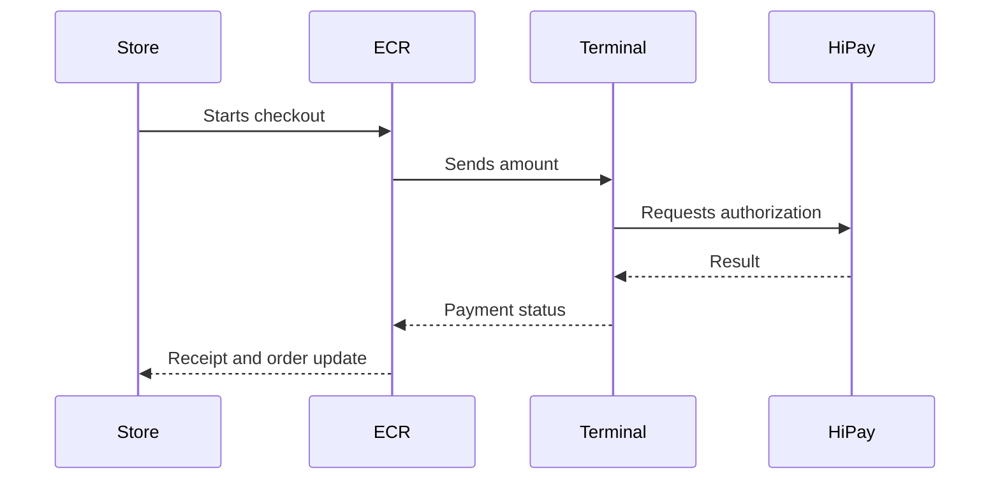

# Point of Sale

Point-of-sale integrations should be documented around the store journey, not only terminal APIs.



Use this path when an online order needs in-store collection or in-store payment completion.



Use this path when the merchant runs payment flows directly on a smart terminal or tablet connector.



Use this path for kiosk and unattended payment scenarios where user prompts and timeout behavior must be explicit.



## Store payment sequence

