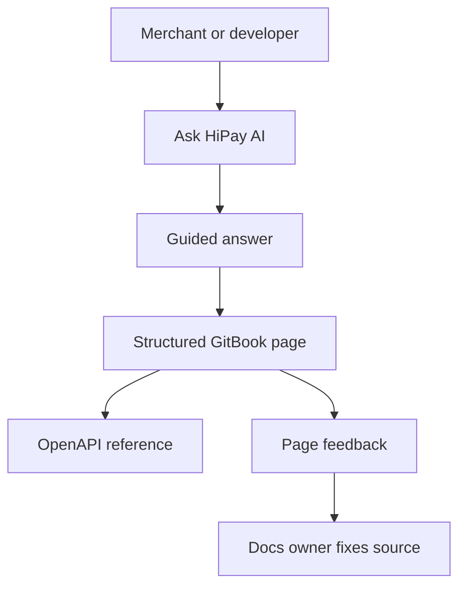

# HiPay Developer Documentation


{% column width="50%" %}
Build, launch, and operate payment experiences across online checkout, marketplaces, mobile apps, and point of sale.

This demo turns HiPay's WordPress developer portal into a modern GitBook experience: curated navigation, AI-assisted answers, OpenAPI-powered references, and authoring blocks that make implementation steps easier to follow.

<button type="button" class="button primary" data-action="ask" data-icon="gitbook-assistant">Ask HiPay AI</button>

<button type="button" class="button secondary" data-action="ask" data-query="Which HiPay integration path should I choose?" data-icon="route">Choose an integration</button> <button type="button" class="button secondary" data-action="ask" data-query="How do I create and refund a test payment?" data-icon="credit-card">Run a payment</button> <button type="button" class="button secondary" data-action="ask" data-query="How do I verify HiPay signatures?" data-icon="shield-check">Verify signatures</button>


{% column width="50%" %}

**A note from GitBook**

This version is intentionally demo-led instead of a raw import. It keeps the HiPay information architecture, but upgrades the pages that matter in a sales conversation with cards, steppers, tabs, code samples, tables, Mermaid diagrams, and OpenAPI blocks.





***

## Start with a goal

<table data-view="cards"><thead><tr><th width="48"></th><th></th><th></th><th data-hidden data-card-target data-type="content-ref"></th></tr></thead><tbody>
<tr><td><h4><i class="fa-route" style="color:$primary;"></i></h4></td><td><strong>Choose an integration path</strong></td><td>Hosted Page, Hosted Fields, API-only, CMS module, mobile SDK, marketplace, or POS.</td><td><a href="https://app.gitbook.com/s/NgbUMQ3SLCpm1fOa0LBR/choose-integration-path">Choose an integration path</a></td></tr>
<tr><td><h4><i class="fa-wand-magic-sparkles" style="color:$primary;"></i></h4></td><td><strong>Use the AI entry point</strong></td><td>Ask implementation questions in natural language and land on the right page or API operation.</td><td><a href="migration-story.md">Use the AI entry point</a></td></tr>
<tr><td><h4><i class="fa-code" style="color:$primary;"></i></h4></td><td><strong>Explore API references</strong></td><td>Use inline OpenAPI blocks for the most important gateway, hosted page, and marketplace operations.</td><td><a href="https://app.gitbook.com/s/iLPCxDjmgR6F8AXe5kC9/">Explore API references</a></td></tr>
<tr><td><h4><i class="fa-store" style="color:$primary;"></i></h4></td><td><strong>Launch commerce channels</strong></td><td>CMS modules, marketplace onboarding, POS, and mobile payments are organized by channel.</td><td><a href="https://app.gitbook.com/s/DXPlTLH37dJoMvok3HAf/">Launch commerce channels</a></td></tr>
</tbody></table>

## Picked for you



Developer view: start with Hosted Fields, API Gateway, webhook signatures, and transaction operations.





Merchant view: start with integration choice, payment methods, CMS launch, and self-service support flows.



<table data-view="cards"><thead><tr><th width="48"></th><th></th><th></th><th data-hidden data-card-target data-type="content-ref"></th></tr></thead><tbody>
<tr><td><h4><i class="fa-credit-card" style="color:$primary;"></i></h4></td><td><strong>Online payments</strong></td><td>Hosted checkout, embedded fields, API-only payment creation, payment means, and maintenance.</td><td><a href="https://app.gitbook.com/s/NgbUMQ3SLCpm1fOa0LBR/">Online payments</a></td></tr>
<tr><td><h4><i class="fa-cart-shopping" style="color:$primary;"></i></h4></td><td><strong>Commerce platforms</strong></td><td>CMS modules, marketplace vendors, mobile apps, and point-of-sale journeys.</td><td><a href="https://app.gitbook.com/s/DXPlTLH37dJoMvok3HAf/">Commerce platforms</a></td></tr>
<tr><td><h4><i class="fa-shield-halved" style="color:$primary;"></i></h4></td><td><strong>Payment fundamentals</strong></td><td>Security, SCA, signatures, transaction lifecycle, statuses, and error handling.</td><td><a href="https://app.gitbook.com/s/77QPwl2jzuBosZDzPHML/">Payment fundamentals</a></td></tr>
<tr><td><h4><i class="fa-terminal" style="color:$primary;"></i></h4></td><td><strong>API reference</strong></td><td>Gateway, Hosted Page, Marketplace, Settlements, Apple Pay, and terminal APIs.</td><td><a href="https://app.gitbook.com/s/iLPCxDjmgR6F8AXe5kC9/">API reference</a></td></tr>
</tbody></table>

## What changed from the WordPress portal


{% column width="50%" %}
### Before

* Long pages with important code samples buried in prose.
* API reference pages maintained separately from the spec.
* Navigation that mirrored WordPress categories.
* Support tickets when merchants could not find current answers.


{% column width="50%" %}
### With GitBook

* AI search and page feedback on every page.
* OpenAPI rendered directly in the docs experience.
* Structured blocks for complex implementation steps.
* A maintainable source workflow for docs owners.


