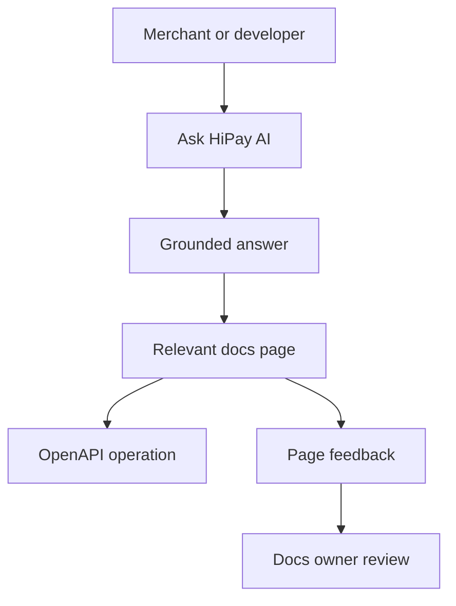

# HiPay Developer Documentation Hub

Augmented payment documentation for merchants, developers, and commerce teams.


{% column width="58%" %}
Move from a maintenance-heavy WordPress portal to a branded GitBook experience where merchants can self-serve, developers can trust generated API references, and editors can keep fast-changing payment guidance current without engineering overhead.


Demo focus: reduce support tickets from stale documentation by putting AI search, OpenAPI rendering, page feedback, and structured authoring workflows in the same portal.



{% column width="42%" %}




## Ask HiPay AI


**What do you want to build?** Try questions like `Which integration path should I choose?`, `How do I verify webhook signatures?`, or `Where is the Hosted Page API reference?`


<table data-view="cards"><thead><tr><th width="48"></th><th></th><th></th><th data-hidden data-card-target data-type="content-ref"></th></tr></thead><tbody>
<tr><td><i class="fa-sparkles"></i></td><td><strong>AI search for implementation answers</strong></td><td>A prominent assistant-style entry point helps merchants find integration, payment method, and troubleshooting answers without opening a support ticket.</td><td><a href="migration-plan.md">AI search demo</a></td></tr>
</tbody></table>

## Choose your path

<table data-view="cards"><thead><tr><th width="48"></th><th></th><th></th><th data-hidden data-card-target data-type="content-ref"></th></tr></thead><tbody>
<tr><td><i class="fa-credit-card"></i></td><td><strong>Integrate online payments</strong></td><td>Hosted Page, Hosted Fields, API-only, SDKs, payment methods, and maintenance.</td><td><a href="https://app.gitbook.com/s/NgbUMQ3SLCpm1fOa0LBR/">Integrate online payments</a></td></tr>
<tr><td><i class="fa-store"></i></td><td><strong>Launch commerce channels</strong></td><td>CMS modules, marketplace onboarding, mobile payments, POS, and online-to-instore flows.</td><td><a href="https://app.gitbook.com/s/DXPlTLH37dJoMvok3HAf/">Launch commerce channels</a></td></tr>
<tr><td><i class="fa-shield-halved"></i></td><td><strong>Understand requirements</strong></td><td>Security, notifications, signature verification, transaction lifecycle, statuses, and errors.</td><td><a href="https://app.gitbook.com/s/77QPwl2jzuBosZDzPHML/">Understand requirements</a></td></tr>
<tr><td><i class="fa-code"></i></td><td><strong>Use the API reference</strong></td><td>Generated OpenAPI pages for gateway, hosted page, marketplace, settlements, and terminal APIs.</td><td><a href="https://app.gitbook.com/s/iLPCxDjmgR6F8AXe5kC9/">Use the API reference</a></td></tr>
</tbody></table>

## Audience segmentation demo



Start with integration paths, SDK examples, OpenAPI operations, test cards, webhooks, and payment lifecycle details.



Use payment method, marketplace, POS, and support-ready pages to answer launch and operations questions without opening a ticket.



Use GitBook change requests, Git Sync, page feedback, AI insights, and reusable content to keep high-change payment docs current.


