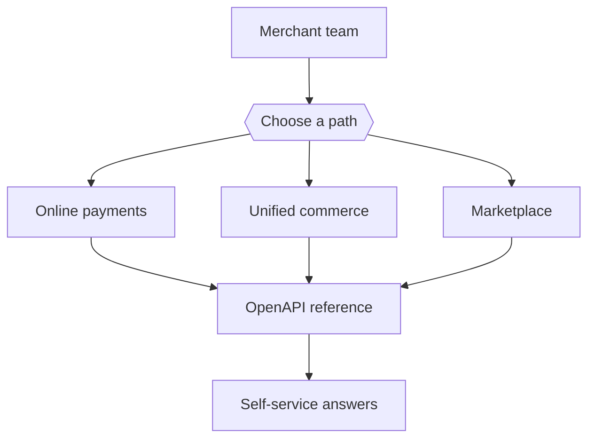

# HiPay Developer Documentation Hub

Augmented payment documentation for online, in-store, marketplace, and agentic commerce teams.


{% column width="56%" %}
This first draft moves HiPay's self-hosted WordPress developer portal into a GitBook-style SaaS documentation hub. It keeps the current content architecture, adds clearer audience paths, and shows how OpenAPI, AI search, page feedback, and editorial review can reduce support tickets from stale or hard-to-find docs.


Demo focus: replace maintenance-heavy WordPress docs with a branded, searchable, API-aware GitBook experience that merchants and implementation teams can self-serve.



{% column width="44%" %}




## Choose your path

<table data-view="cards"><thead><tr><th width="48"></th><th></th><th></th><th data-hidden data-card-target data-type="content-ref"></th></tr></thead><tbody>
<tr><td><i class="fa-credit-card"></i></td><td><strong>Integrate online payments</strong></td><td>Hosted Page, Hosted Fields, API-only, SDKs, payment methods, and maintenance.</td><td><a href="https://app.gitbook.com/s/XSPACE_ONLINE/">Integrate online payments</a></td></tr>
<tr><td><i class="fa-store"></i></td><td><strong>Launch commerce channels</strong></td><td>CMS modules, marketplace onboarding, mobile payments, POS, and online-to-instore flows.</td><td><a href="https://app.gitbook.com/s/XSPACE_COMMERCE/">Launch commerce channels</a></td></tr>
<tr><td><i class="fa-shield-halved"></i></td><td><strong>Understand requirements</strong></td><td>Security, notifications, signature verification, transaction lifecycle, statuses, and errors.</td><td><a href="https://app.gitbook.com/s/XSPACE_FUNDAMENTALS/">Understand requirements</a></td></tr>
<tr><td><i class="fa-code"></i></td><td><strong>Use the API reference</strong></td><td>Generated OpenAPI pages for gateway, hosted page, marketplace, settlements, and terminal APIs.</td><td><a href="https://app.gitbook.com/s/XSPACE_API/">Use the API reference</a></td></tr>
</tbody></table>

## Audience segmentation demo



Start with integration paths, SDK examples, OpenAPI operations, test cards, webhooks, and payment lifecycle details.



Use payment method, marketplace, POS, and support-ready pages to answer launch and operations questions without opening a ticket.



Use GitBook change requests, Git Sync, page feedback, AI insights, and reusable content to keep high-change payment docs current.


