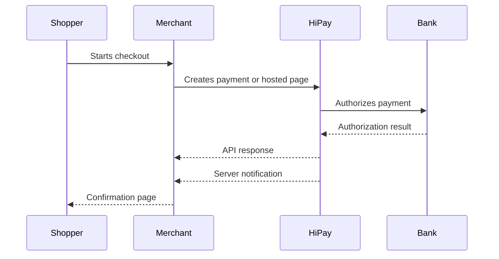

# Online Payments

Accept online payments with Hosted Page, Hosted Fields, API-only flows, SDKs, and payment methods that match each merchant journey.

<button type="button" class="button primary" data-action="ask" data-query="Which HiPay online payment integration should I choose?" data-icon="gitbook-assistant">Ask which integration fits</button>

<table data-view="cards"><thead><tr><th width="48"></th><th></th><th></th><th data-hidden data-card-target data-type="content-ref"></th></tr></thead><tbody>
<tr><td><h4><i class="fa-route" style="color:$primary;"></i></h4></td><td><strong>Choose an integration path</strong></td><td>Compare Hosted Page, Hosted Fields, Hosted Payments, API-only, and CMS module routes.</td><td><a href="choose-integration-path.md">Choose an integration path</a></td></tr>
<tr><td><h4><i class="fa-window-maximize" style="color:$primary;"></i></h4></td><td><strong>Hosted Page quickstart</strong></td><td>Redirect customers to a HiPay-hosted checkout and customize the experience.</td><td><a href="hosted-page-quickstart.md">Hosted Page quickstart</a></td></tr>
<tr><td><h4><i class="fa-credit-card" style="color:$primary;"></i></h4></td><td><strong>Hosted Fields quickstart</strong></td><td>Embed secure card fields while keeping sensitive data off your servers.</td><td><a href="hosted-fields-quickstart.md">Hosted Fields quickstart</a></td></tr>
<tr><td><h4><i class="fa-bell" style="color:$primary;"></i></h4></td><td><strong>Webhooks and notifications</strong></td><td>Receive server-to-server notifications and keep merchant systems in sync.</td><td><a href="webhooks-and-notifications.md">Webhooks and notifications</a></td></tr>
</tbody></table>

## Payment flow at a glance

