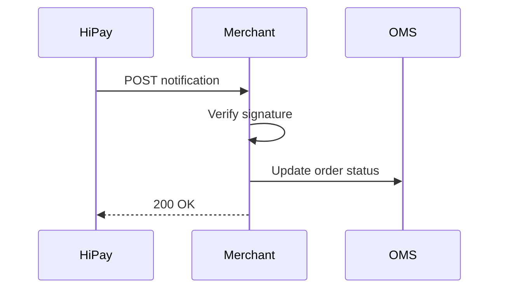

# Webhooks and notifications

Server-to-server notifications are the reliable source for payment status changes. Redirect pages improve shopper experience, but notifications update the merchant system.



## Expose a notification endpoint

Create an HTTPS endpoint that accepts HiPay notification payloads and logs the raw request for audit and replay.



## Verify the signature

Reject notifications where the signature does not match the shared secret or expected account.



## Make processing idempotent

Store the transaction reference and status transition so repeated notifications do not duplicate operations.



## Return a 2xx response

Return success only after the merchant system has persisted the status update.




Do not mark an order as paid from the shopper redirect alone. Always wait for the HiPay server notification or verify transaction status through the API.

