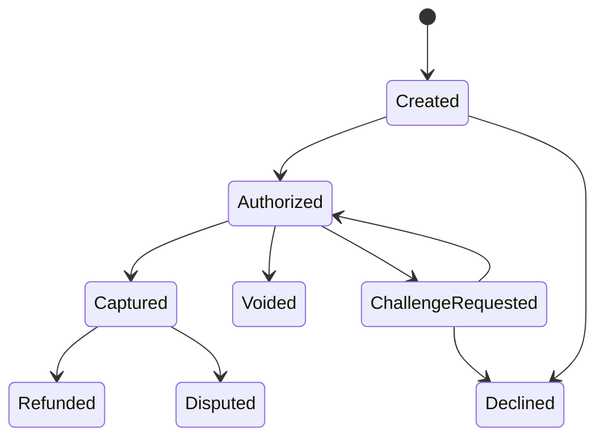

# Transaction lifecycle

| State | Meaning | Merchant action |
| --- | --- | --- |
| Created | Payment attempt exists | Wait for authorization or notification |
| Authorized | Funds approved | Capture, ship, or void according to business rules |
| Challenge requested | Authentication step required | Let shopper complete the challenge |
| Captured | Funds captured | Fulfill order and reconcile settlement |
| Refunded | Funds returned | Update order and customer communication |
| Declined | Payment failed | Show retry or alternative payment method |
